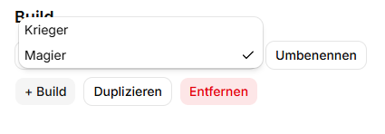
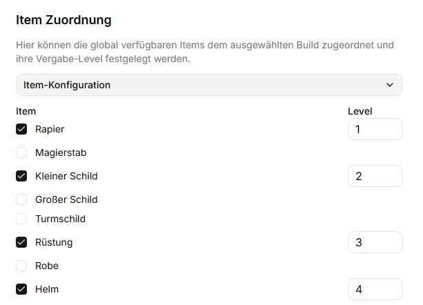
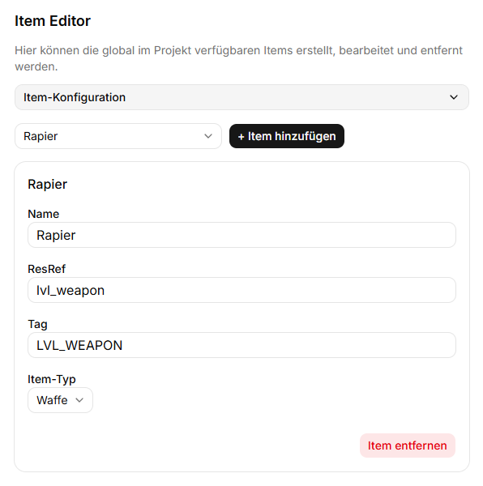
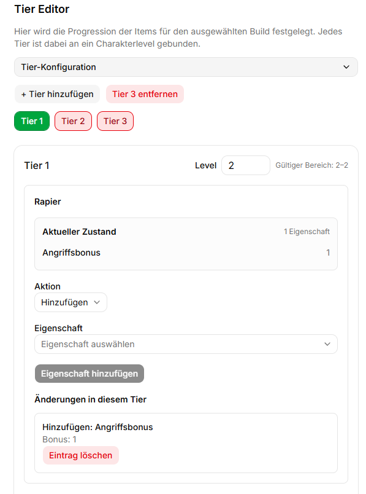
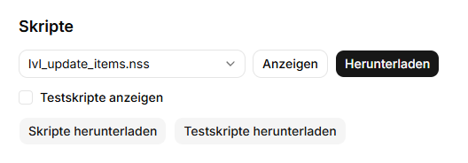
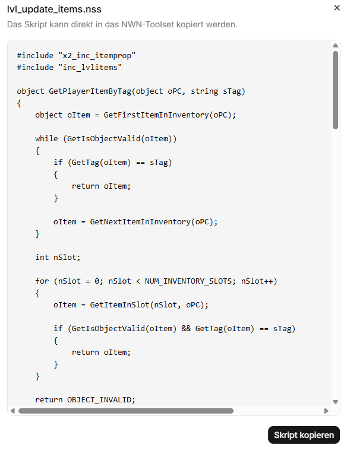

# NWN Skript Generator

Der **NWN Skript Generator** ist eine Anwendung zur Erstellung von Level-Up-Skripten für **Neverwinter Nights: Enhanced Edition**.

Mit der Anwendung können Items definiert werden, die sich abhängig vom Charakterlevel weiterentwickeln. Die gewünschten Item-Eigenschaften werden über ein Tier-System konfiguriert und anschließend automatisch als NWScript-Skripte generiert.

Die Anwendung steht neben der Webseite auch als Windows-Desktopanwendung auf Basis von Tauri zur Verfügung.

## Features

- Verwaltung unterschiedlicher Charakter-Builds
- Globale Verwaltung der verwendeten Items
- Zuordnung von Items und Startleveln zu einzelnen Builds
- Frei konfigurierbare Level-Tiers
- Item-Eigenschaften hinzufügen, ersetzen und entfernen
- Automatische Generierung der benötigten NWScript-Skripte
- Anzeige und Export der generierten `.nss`-Dateien
- Direkte Kompilierung der Skripte mit `nwnsc`
- Automatische Erkennung einer Steam-Installation von Neverwinter Nights
- Automatische Erkennung des NWN-Benutzerverzeichnisses bei Verwendung des Standardpfads

## Build und Item-Zuordnung

Für unterschiedliche Spielweisen können eigene Builds angelegt werden, beispielsweise für Kämpfer, Magier oder Schurken.

Jedem Build können die global verfügbaren Items zugeordnet werden. Dabei wird für jedes Item festgelegt, ab welchem Charakterlevel es zur Verfügung stehen soll.





## Item Editor

Im Item Editor werden die Items verwaltet, die anschließend in allen Builds verwendet werden können.

Für jedes Item werden unter anderem folgende Angaben festgelegt:

- **Name** – Anzeigename innerhalb des Skript Generators
- **ResRef** – ResRef des im NWN Toolset erstellten Blueprints
- **Tag** – eindeutiger Tag, über den das Item im Spiel identifiziert wird
- **Item-Typ** – beispielsweise Waffe, Schild oder Rüstung



### Blueprints

Die eigentlichen Item-Blueprints müssen im **Neverwinter Nights Toolset** erstellt werden.

ResRef und Tag im Skript Generator müssen mit den entsprechenden Blueprints übereinstimmen. Die benötigten Blueprints müssen im `development`-Verzeichnis des NWN-Benutzerverzeichnisses vorhanden sein.

## Tier Editor

Im Tier Editor wird festgelegt, wie sich die Items eines Builds mit steigendem Charakterlevel entwickeln.

Jedes Tier wird einem Charakterlevel zugeordnet. Dadurch kann beispielsweise eine Progression wie

- Tier 1 → Level 3
- Tier 2 → Level 5
- Tier 3 → Level 8

erstellt werden.

Alternativ können Tiers auch für einzelne aufeinanderfolgende Level angelegt werden. Möglich sind bis zu 39 Tiers für die Charakterlevel bis Level 40.

Für die Item-Eigenschaften stehen drei grundlegende Aktionen zur Verfügung:

- **Hinzufügen**
- **Ersetzen**
- **Entfernen**

Der Editor zeigt außerdem den aktuellen Zustand eines Items im jeweiligen Tier an.



## Skripte

Aus der konfigurierten Item-Progression erzeugt die Anwendung die benötigten NWScript-Dateien.

Die generierten Skripte können direkt in der Anwendung angezeigt und kopiert oder als `.nss`-Dateien exportiert werden.



Die Skriptvorschau ermöglicht es, den generierten NWScript-Code vor der weiteren Verwendung zu kontrollieren.



## Desktopanwendung

Die Tauri-Desktopversion kann die generierten Skripte direkt mit `nwnsc` kompilieren und die erzeugten Dateien im `development`-Ordner des NWN-Benutzerverzeichnisses ablegen.

In den Einstellungen werden dafür zwei Pfade verwendet:

### NWN-Installation

Installationsverzeichnis von **Neverwinter Nights: Enhanced Edition**.

Bei einer Steam-Installation versucht die Anwendung, das Installationsverzeichnis automatisch zu erkennen.

### NWN-Benutzerverzeichnis

Das Benutzerverzeichnis enthält unter anderem Spielstände, Module und den `development`-Ordner.

Befindet sich das NWN-Benutzerverzeichnis am Standardort unter Dokumente, kann es automatisch erkannt werden.

## Installation

Die aktuelle Windows-Version befindet sich unter **Releases**.

Für die normale Installation wird der NSIS-Installer empfohlen:

`NWN Skript Generator_1.0.0_x64-setup.exe`

Nach der Installation kann der NWN Skript Generator wie eine normale Windows-Anwendung gestartet werden.

## Entwicklung

### Voraussetzungen

Für die Entwicklung werden unter anderem benötigt:

- Node.js
- Rust
- Tauri

Abhängigkeiten installieren:

```bash
npm install
```

Entwicklungsmodus starten:

```bash
npm run tauri dev
```

Release-Version erstellen:

```bash
npm run tauri build
```

Die erzeugten Windows-Installer befinden sich anschließend unter:

```text
src-tauri/target/release/bundle/
```

## Hinweise

Der NWN Skript Generator ist ein unabhängiges Fan-/Community-Projekt für **Neverwinter Nights: Enhanced Edition**.

Neverwinter Nights und zugehörige Bezeichnungen und Marken gehören ihren jeweiligen Rechteinhabern.

## Lizenz

Dieses Projekt ist unter der **GNU General Public License v3.0 (GPL-3.0-only)** lizenziert.

Siehe [LICENSE](LICENSE) für die vollständigen Lizenzbedingungen.
